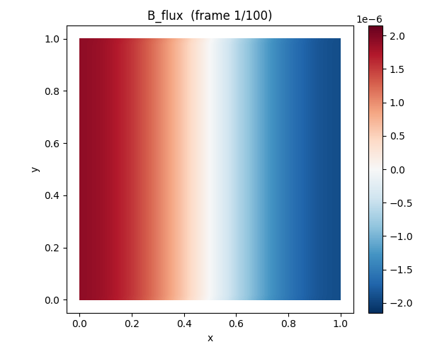

# Examples

Electromagnetic examples demonstrating the flux Maxwell solver on
triangulated and tetrahedral PEC cavities.



---

## Quick start

For realistic throughput numbers, run the example in `ReleaseFast`:

```sh
zig build -Doptimize=ReleaseFast example-maxwell2d -- --demo dipole
zig build -Doptimize=ReleaseFast example-maxwell2d -- --help
zig build -Doptimize=ReleaseFast example-maxwell3d -- --steps 400 --dt 0.0025
zig build -Doptimize=ReleaseFast example-euler3d -- --steps 1000
zig build -Doptimize=ReleaseFast example-heat -- --grid 32 --frames 8
```

The default `zig build` mode is `Debug`, which is useful for development but
materially slower on larger grids.

Visualize the output (requires Python 3.10+ and [uv](https://github.com/astral-sh/uv)):

```sh
uv run tools/visualize.py output --field B_flux --output animation.png
uv run tools/visualize.py output --field B_flux --output animation.gif
uv run tools/visualize.py output/euler_2d --output animation.png
```

APNG is now the default recommendation because it preserves full color. Use
`.gif` only when you specifically need GIF compatibility; GIF is limited to a
256-color palette and will show more banding.

---

## Demos

| Demo | What it does | Example |
|------|-------------|---------|
| [**dipole**](dipole-radiation.md) | Point source radiating + reflecting off PEC walls | `zig build -Doptimize=ReleaseFast example-maxwell2d -- --demo dipole` |
| [**cavity**](cavity-resonance.md) | Source-free TE₁₀ standing wave, analytical validation | `zig build -Doptimize=ReleaseFast example-maxwell2d -- --demo cavity` |
| [**maxwell_3d**](maxwell_3d/README.md) | Source-free TM₁₁₀ rectangular cavity mode on tetrahedra with 3D convergence check | `zig build -Doptimize=ReleaseFast example-maxwell3d -- --steps 400 --dt 0.0025` |
| [**euler_2d**](euler_2d/README.md) | Incompressible vorticity-stream evolution with conservative circulation transport | `zig build -Doptimize=ReleaseFast example-euler2d -- --grid 32 --steps 1000` |
| [**euler_3d**](euler_3d/README.md) | Steady helical reference mode on tetrahedra with exact helicity regression checks through the 1-form solve path | `zig build -Doptimize=ReleaseFast example-euler3d -- --steps 1000` |
| [**heat**](heat/README.md) | Backward-Euler diffusion on a unit square with CG solve, homogeneous Dirichlet boundary data, and convergence verification | `zig build -Doptimize=ReleaseFast example-heat -- --grid 32 --frames 8` |

---

## CLI reference

```
usage: flux [--demo <name>] [options]

demos:
  dipole    (default) point dipole radiating in a PEC cavity
  cavity    TE₁₀ standing wave — exact analytical mode, source-free

mesh & physics:
  --grid N          grid cells per side (default: 32)
  --domain L        square domain side length (default: 1.0)
  --courant C       Courant number dt = C·h (default: 0.1)

dipole source (ignored for cavity demo):
  --frequency F     source frequency in Hz (default: TE₁₀ resonance)
  --amplitude A     source amplitude (default: 1.0)

time stepping:
  --steps N         number of timesteps (default: 1000)

output:
  --output DIR      output directory for VTK files (default: output)
  --frames N        number of VTK snapshots to write (default: 100)
```

### Parameter relationships

The timestep is derived from the mesh: **dt = courant × h**, where h = domain / grid.
This means:
- Doubling `--grid` halves h and halves dt — you need ~2× more steps for the
  same physical time.
- Increasing `--courant` makes each step cover more time but adds numerical
  dispersion.

The total simulation time is **t = steps × dt**. For the cavity demo, one field
period is T = 2 × domain, so you need steps = T / dt = 2 × domain / (courant × h)
steps per period.

| Grid | dt (C=0.1) | Steps for 1 period (L=1) |
|------|-----------|--------------------------|
| 16 | 0.00625 | 320 |
| 32 | 0.003125 | 640 |
| 64 | 0.001563 | 1280 |

---

## Visualization tools

### tools/visualize.py — animated APNG/GIF

Parses VTK `.vtu` files and renders an animation with matplotlib. Triangle
meshes render as 2D pseudocolor plots; tetrahedral meshes render as 3D
cell-barycenter animations. No ParaView needed — `uv` handles dependencies
automatically.

```sh
uv run tools/visualize.py <input_dir> [options]
```

| Flag | Default | Description |
|------|---------|-------------|
| `--field` | auto | Scalar field to plot; auto-selects `tracer`, `vorticity`, `B_flux`, `E_intensity`, or another available scalar |
| `--vectors` | auto | Optional 2D vector overlay; auto-selects `velocity` when present, use `none` to disable |
| `--output` | `<dir>/animation.png` | Output animation path; `.png`/`.apng` writes full-color APNG, `.gif` writes palette-limited GIF |
| `--fps` | 12 | Frames per second |

Available fields:

| Field | What it is |
|-------|-----------|
| `B_flux` | Magnetic flux per face (primal 2-form) |
| `E_intensity` | Electric field averaged to faces (primal 1-form projected) |
| `tracer` | Passive tracer transported by the 2D Euler showcase demo |
| `vorticity` | Face-centered 2D Euler vorticity |
| `stream_function` | Vertex-centered stream function |
| `velocity` | 2D Euler face velocity (vector overlay) |

### ParaView

For interactive exploration, open the `.pvd` collection file:

```sh
open output/cavity.pvd       # macOS
paraview output/dipole.pvd   # Linux
```

The `.pvd` indexes all snapshots with simulation timestamps for correct
time-axis playback. ParaView supports custom colormaps, streamlines, animation
export, and 3D viewing.

---

## Numerical background

The simulations use **Discrete Exterior Calculus (DEC)** on 2D simplicial
meshes. Fields are typed cochains — E is a primal 1-form (per edge), B is a
primal 2-form (per face) — with operator compatibility enforced at compile time.

The **leapfrog integrator** staggers E at integer steps and B at half-steps
(Yee-style), giving second-order time accuracy and symplectic structure (energy
conservation for source-free runs).

**Key invariant**: dB = 0 is enforced structurally — in 2D, B is a top-form, so
d₂B lives in the nonexistent 3-form space. The type system rejects
`exterior_derivative(B)` at compile time.

See the individual demo pages for physics details and parameter exploration
guides.
