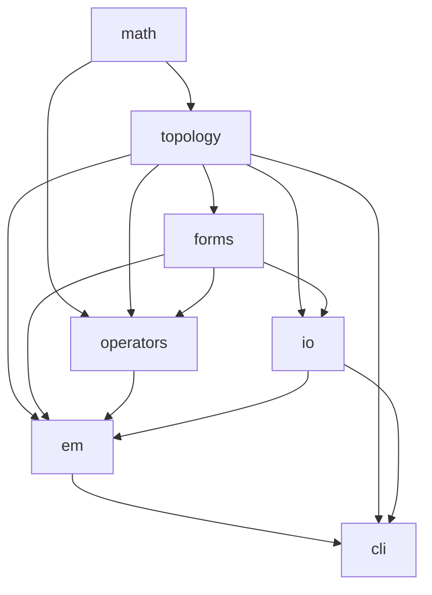

# Component Scope Map

This file defines the codebase's component boundaries. Skills use it to limit
context window usage — when working on an issue in a given domain, load only
that component's files and its direct dependencies.

## Components

### topology
**Domain label:** `domain/topology`
**Owns:** `src/topology/`
**Dependencies:** `src/math/` (sparse matrix types)
**Description:** CW complex representation, incidence/boundary matrices, mesh
construction, dual mesh computation, geometric data (edge lengths, face areas,
dual volumes).

### forms
**Domain label:** `domain/forms`
**Owns:** `src/forms/`
**Dependencies:** `src/topology/` (mesh types for comptime parameterization)
**Description:** Discrete k-forms (cochains) parameterized by mesh and degree at
comptime. Arithmetic operations on cochains (add, scale, negate).

### operators
**Domain label:** `domain/operators`
**Owns:** `src/operators/`
**Dependencies:** `src/topology/`, `src/forms/`, `src/math/`
**Description:** Discrete exterior derivative, Hodge star, Laplacian, operator
composition. Each operator is an independent, testable unit.

### concepts
**Domain label:** `domain/topology`
**Owns:** `src/concepts/`
**Dependencies:** `src/topology/`
**Description:** Comptime concept validators (`MeshConcept`). Enforce compile-time
contracts on user-defined types so alternative mesh implementations (mesh views,
imported meshes, n-dimensional meshes) are guaranteed compatible with the operator stack.

### math
**Domain label:** `domain/build` (no dedicated label yet)
**Owns:** `src/math/`
**Dependencies:** none
**Description:** Low-level math primitives — sparse matrix types (CSR), linear
algebra utilities. Foundation layer with no upward dependencies.

### io
**Domain label:** `domain/io`
**Owns:** `src/io/`
**Dependencies:** `src/topology/`, `src/forms/`
**Description:** VTK export for visualization. Reads mesh and cochain data,
writes `.vtu` files.

### em
**Domain label:** `domain/em`
**Owns:** `src/em/`
**Dependencies:** `src/topology/`, `src/forms/`, `src/operators/`, `src/io/`
**Description:** Electromagnetics simulation — Maxwell leapfrog integrator,
field initialization, boundary conditions, source terms. Currently a concrete
application; targeted for extraction to `examples/` when the trait system exists.

### cli
**Domain label:** `domain/build`
**Owns:** `src/main.zig`
**Dependencies:** `src/em/`, `src/topology/`, `src/io/`
**Description:** Command-line interface entry point. Parses arguments, runs
simulations, controls output.

### library
**Domain label:** `domain/build`
**Owns:** `src/root.zig`
**Dependencies:** all `src/` modules
**Description:** Library entry point — re-exports public API. Changes here
affect what downstream consumers see.

### ci
**Domain label:** `domain/ci`
**Owns:** `.github/`, `build.zig`
**Dependencies:** none (build-system level)
**Description:** CI workflows, GitHub settings, build configuration, label
definitions, issue templates.

### project
**Domain label:** `domain/docs`
**Owns:** `project/`, `.claude/`
**Dependencies:** none
**Description:** Epoch planning, decision logs, retrospectives, skill
definitions, vision and horizons documents.

## Dependency graph

## Usage

When `/tackle` identifies an issue's domain, it should:
1. Look up the component in this file
2. Read the **Owns** files and **Dependencies** files
3. Do not read files outside this set unless the issue explicitly crosses component boundaries
4. If a cross-component change is needed, state which components are involved and why
