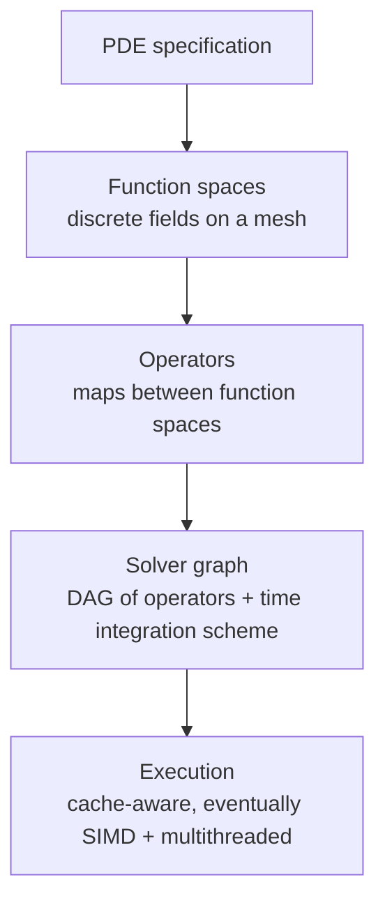

# flux: Vision and Philosophy

## What flux is

flux is a composable PDE solver framework in Zig. Its goal is to make it possible
to assemble a high-fidelity, high-performance numerical solver for a wide class of
PDEs by composing well-understood, mathematically rigorous building blocks — rather
than inheriting a monolithic framework designed around a single discretization
philosophy.

The central abstraction is the **operator on a function space**: a map between two
spaces of discrete fields defined on a mesh. A PDE solver is a directed acyclic
graph of such operators. flux provides the nodes (function spaces), the edges
(operators), and the composition rules. The user provides the graph.

This is not a new idea mathematically. It is, however, largely absent from existing
production frameworks, which tend to couple discretization, assembly, and solver into
a single opinionated pipeline. flux decouples them.

---

## Why now, why Zig

The major PDE frameworks — deal.II, MFEM, Firedrake, FEniCS — are mature, capable,
and genuinely excellent. This project is not an attempt to replace them. It is an
attempt to explore what becomes possible when you start from scratch with a language
that did not exist when they were designed.

Zig offers three things no C++ framework can offer cleanly:

**1. Comptime as a type system for mathematics.**
Zig's `comptime` evaluation allows the type of a discrete k-form to carry its
degree, its mesh, and its orientation convention as compile-time parameters. A
function accepting a 1-form can *reject a 2-form at compile time*, not at runtime.
Operator composition can be checked for dimensional compatibility before the program
runs. The type system enforces the algebra.

**2. Zero-cost abstraction without template pathology.**
C++ templates achieve similar goals but at the cost of unreadable error messages,
slow compilation, and architectural complexity that discourages experimentation.
Zig comptime is readable, debuggable, and composable in ways that make the math
legible in the code.

**3. Explicit, auditable memory.**
Every allocation in flux is explicit, allocator-parameterized, and traceable.
There is no garbage collector, no hidden heap traffic, no runtime surprises.
For HPC workloads — where cache behavior and memory bandwidth dominate — this
matters as much as algorithmic complexity.

The goal is to write code that a mathematician can read and an HPC engineer can
trust. That combination is rare. Zig makes it achievable.

---

## Design commitments

These are non-negotiable. They are the load-bearing walls of the architecture.
Deviating from them requires a decision log entry and a compelling reason.

**Geometric fidelity as a structural invariant.**
Conservation laws (∇·B = 0, Kelvin circulation, energy balance) must be enforced
by the structure of the discretization, not approximated numerically. If a
method cannot guarantee an invariant exactly, the invariant must be exposed
as a property test that quantifies the violation — it is never silently ignored.

**Operator-level composability.**
Every discrete operator — exterior derivative, Hodge star, interior product,
projection, restriction — is an independent, testable unit. Solvers are built
by composing operators. No solver hardcodes a discretization choice.

**comptime type safety for function spaces.**
The degree of a cochain, the dimension of the underlying mesh, and the
orientation conventions must all be comptime parameters. Incompatible
compositions are compile errors.

**SoA layout and explicit allocators throughout.**
All mesh entity data uses struct-of-arrays layout (`std.MultiArrayList` or
equivalent) for SIMD vectorizability and L1 cache efficiency. Every data
structure accepts an explicit `std.mem.Allocator`. No hidden heap allocations.

**Tests as mathematical proof obligations.**
A discrete operator is not implemented until a property-based test exists that
verifies its mathematical invariant on random inputs. `dd = 0` is not a feature
— it is a contract, and the test is the contract's enforcement mechanism.

**Usability is a correctness property.**
The comptime type system exists to make correct code easy to write and incorrect
code impossible to compile. If a type-level abstraction makes the framework
harder to use without a proportional safety gain, it is over-engineering. The
test: a domain expert who knows the mathematics should be able to read a
simulation setup and recognize the physics without reading the framework
internals.

**Geometric generality as a design horizon.**
The initial implementation assumes a fixed mesh with a flat (Euclidean) metric.
This is a specialization, not a limitation. The architecture must remain
compatible with:

- **General Riemannian metrics**, where the Hodge star `★_g` depends on a metric
  tensor `g` rather than Euclidean volume ratios
- **Semi-Riemannian (Lorentzian) metrics**, where inner products are indefinite
  and `★★` picks up signature-dependent signs
- **Intrinsic PDEs** (moving meshes, geometric flows, elasticity), where the mesh
  geometry is a dynamical variable and metric-dependent operators must be
  recomputed as the configuration evolves

The exterior derivative `d` is purely topological and unaffected by these
generalizations — this is a core strength of the FEEC/DEC approach. Metric
dependence is isolated in the Hodge star and inner product operators. The design
strategy is to make the metric an explicit parameter at the type level (e.g.,
`Metric(.flat)` as the current default) so that generalization is an extension,
not a refactor.

This is a horizon, not a roadmap item. No code should be written for general
metrics until a concrete problem demands it. But no interface should be designed
in a way that assumes flatness implicitly.

---

## The abstraction hierarchy

Each level is independently swappable. A user who wants to replace the Hodge star
with a higher-order mass matrix should touch exactly one node in the graph. A user
who wants to swap leapfrog for a Runge-Kutta integrator should touch exactly one
node. Nothing else should change.

This is the warehouse model: flux is a well-curated collection of components with
compatible interfaces. Users compose them. The framework does not prescribe the
composition.

---

## Solver taxonomy (long-term)

flux will eventually support multiple discretization families, unified under the
operator abstraction:

| Family | Primary use cases | Key operators |
|--------|------------------|---------------|
| FEEC / DEC | Maxwell, incompressible Euler, diffusion | d, ★, ∂ |
| DG-FEM | Hyperbolic conservation laws, transport | flux integrals, trace operators |
| Mimetic FD | Structured-grid approximations of FEEC | Discrete grad, div, curl |
| Spectral element | High-accuracy smooth problems | Interpolation, differentiation matrices |
| Particle / PIC | Plasma, kinetic theory | Particle-mesh coupling |

This taxonomy is aspirational, not a roadmap. It exists to ensure that early
abstractions are not so specific to one method that they cannot be extended to
the others.

Before adding a new solver family, the question to answer is: *what operators and
function spaces does this method require, and how do they compose with what already
exists?* If the answer requires breaking existing interfaces, that is a signal the
abstraction is not yet right.

---

## Primary users

**Applied mathematicians** who care about geometric fidelity and want to trust that
their invariants are actually preserved. They should be able to read the operator
implementations and recognize the mathematics.

**HPC engineers** who need to understand and control memory layout, cache behavior,
and computational throughput. They should be able to inspect every allocation path
and predict performance from the source code.

Python interoperability, graphical interfaces, and distributed-memory MPI are not
in scope for the initial development. They may be addressed later, through FFI or
an optional shim layer, but they will not shape the core API.

---

## What flux is not

- A drop-in replacement for deal.II, MFEM, or Firedrake.
- A general-purpose linear algebra library.
- A mesh generation tool.
- A visualization engine (the VTK export is a debugging aid, not a product).
- A Python package.
- A framework that makes tradeoffs for the sake of ease of use at the expense of
  correctness or performance.

---

## Development philosophy

flux is developed in the tradition of deal.II and TigerBeetle: rigorous,
deliberate, and documented. Every non-obvious architectural decision is logged in
the epoch's `decision_log.md`. Every invariant has a test. Every operator has a
mathematical citation.

The project is small enough that the right approach is usually to do it once,
correctly, rather than iterate toward correctness. Simple code is not the first
draft — it is the result of understanding the problem well enough to express it
clearly. Refactors are not churn; they are the project doing its job.

Development is AI-assisted and fast by design. The mathematical foundations are
well-studied, the literature is rich, and modern tooling (AI pair programming,
property-based testing, fast compilation) means we can move faster than comparable
projects could a decade ago. The constraint is not velocity — it is maintaining
the mathematical and software quality that makes the velocity sustainable.

